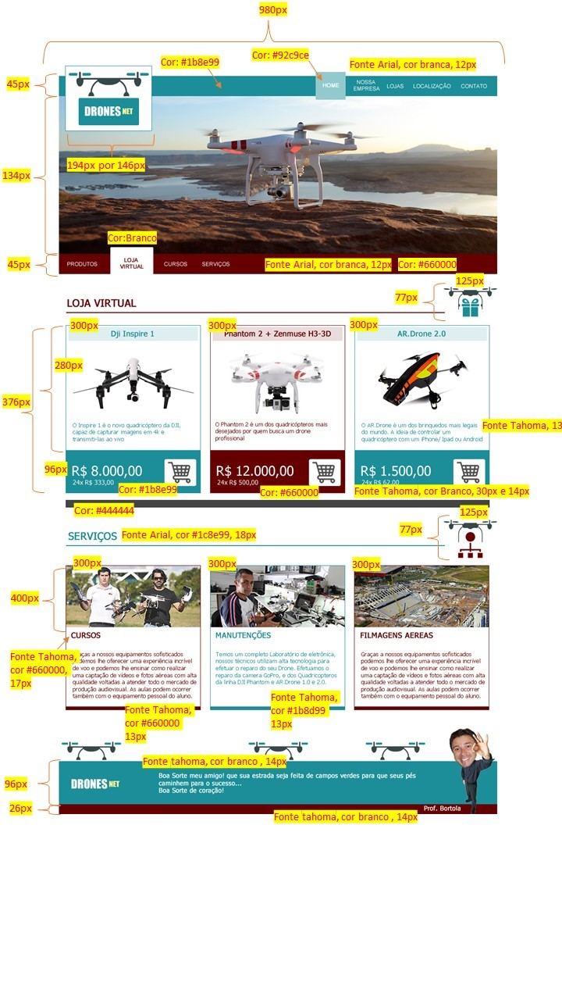

# FIAP-phaseOne_Chulamis
Small page that is a phase one project of the Faculty of Software Engineering at FIAP.

```
Faça o upload de sua atividade na plataforma FIAP ON, na seção de atividades, e aguarde a nota e o feedback do professor.
```
 
### 1.1 Introdução
 
A Chulamis é uma empresa inovadora, focada no desenvolvimento tecnológico da sociedade.
Trabalham fortemente para que as inovações possam fazer toda a diferença nos resultados dos clientes e parceiros.
Apreciam e apoiam um modelo de trabalho moderno, dando liberdade para a criatividade e focando o resultado de uma maneira sustentável e responsável.

O profissionalismo e a qualidade de seus serviços prestados são um diferencial da Chulamis e servem de parâmetro na satisfação dos clientes.
Eles têm como atividade principal a utilização de drones para serviços, treinamentos, vendas e assistência técnica. Contam com uma área de pesquisa e desenvolvimento para atender às demandas de projetos customizados nas quais atuam, desde o levantamento de requisitos até a execução de projetos.

Situada na cidade de São Paulo, a Chulamis atende a todo o território nacional, mas, com isso, precisam reformular todo seu site, que hoje está muito defasado.

A empresa Chulamis contratou o Bortola, um Web Designer bem renomado na área, para desenvolver seu site. O layout foi aprovado pela diretoria, porém o responsável pela identidade visual teve um problema de saúde e não vai conseguir entregar este projeto. Um dos executivos da empresa entrou em contato com a FIAP, para apoiar neste desafio, pois ele sabe que os alunos desta instituição são feras e topam qualquer desafio!   

Com base no que aprendemos nas videoaulas, vamos ajudar a empresa Chulamis a criar esse site de vendas de drones, com alguns serviços adicionais (Figura “Loja Virtual – Drones Net”).


Figura 1 – Loja Virtual – Drones Net
*Fonte: Drones Net (2022)*

Nosso amigo Bortola já deixou algumas especificações prontas (regras) para nos ajudar no desenvolvimento. Lembrando que a diretoria da empresa Chulamis já aprovou esse layout, portanto, precisamos manter a identidade visual.

 
Figura 2 – Loja Virtual – Drones Net
*Fonte: Drones Net (2022)*

**Obs: Seguir o layout proposto, os valores sugeridos não precisam estar 100% como mostra no exemplo acima, o importante e manter a mesma estrutura e cores.**

Vamos ao que interessa, vamos ajudar a empresa Chulamis!

### 1.2 Avaliação
 
Ao finalizar o projeto, favor colocar todo o material feito em zip e enviar via portal.
 
### 1.3 Regras para este desafio:
 

Não utilizar nenhum framework;
Utilizar apenas HTML e CSS;
Trabalhos iguais serão anulados;
Manter a mesma estrutura do site (pastas e arquivos)
Seguir as mesmas regras do que estão na imagem.

 
### 1.4 Material
 
O material para download estará disponível na área do aluno.
As imagens fornecidas são brutas (várias no mesmo arquivo). Gere as imagens individuais as recortando.
 

**
Boa sorte!
**                          